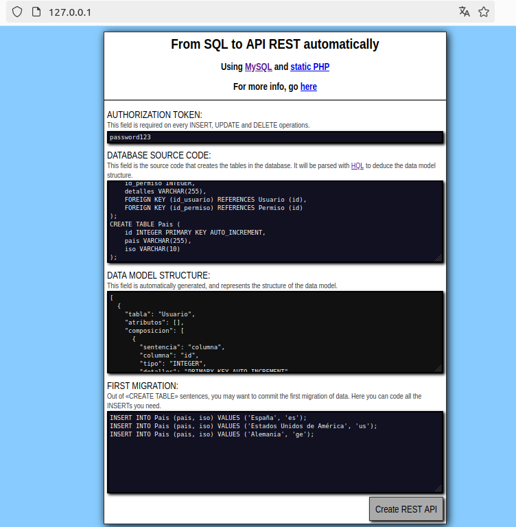
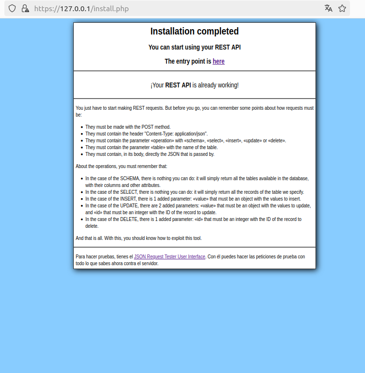
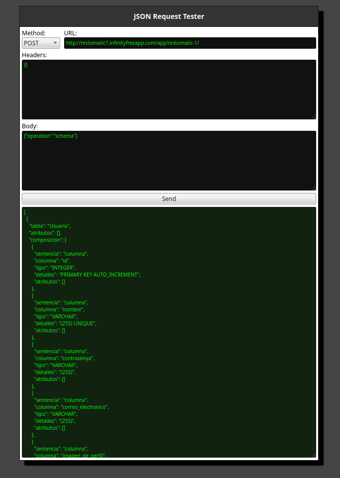

# restomatic-php

Little framework to automate HTTP REST API deployments based on SQL (SQLite or MySQL) databases.

## For what?

To build easy and fast HTTP REST APIs using static PHP and SQL database (SQLite or MySQL).

## Installation

1. Download the project.
2. Place the project on the folder of the static PHP server you prefer.
3. Set your specific environment variables on «settings.php». The database connection credentials and things like that.
4. Visit the «index.php» with the navigator in order to open the installator. The «installer.php» will load. *Image 1.* 
5. Fulfill the installator. *Image 2.* 
   1. This implies you give credentials to connect to a MySQL/SQLite **EMPTY** database.
   2. This also implies to have **AN EMPTY** database. So: empty your database before the next step.
6. Click on "Create REST API". *Image 3.* 
7. Visit the «/tester» to test your new fresh API. *Image 4.* 

## Reset the API

To reset the API (this is: to reset the database and reinstall restomatic) you have 2 environments: MySQL and SQLite. Both are very similar.

### Reset the API on MySQL

To reset the API on MySQL, follow the next steps:

1. Delete all the tables in the database with the «DROP TABLE» sentence.
2. Delete the «installed.txt» file.
3. Open the browser.
4. Go to «installer.php»
5. Fulfill the form.
6. Click «Create REST API».
7. Voilá.

### Reset the API on SQLite

To reset the API on SQLite, follow the next steps:

1. Delete the «database.sqlite» file.
2. Delete the «installed.txt» file.
3. Open the browser.
4. Go to «installer.php».
5. Fulfill the form.
6. Click «Create REST API».
7. Voilá.

## Coding

The project is minimal-oriented. But one of the goals was to support customizable business logic for the REST API. This is why *hooks*.

When I say *hooks*, it is only a fixed lifecycle that can be customnized simply writting code in php files. Specifically, under the `hooks` folder, we can find all the hooks that are called during the natural lifeycle.

Each hook has a name and a folder (with that name), and most of that folders have 3 files inside:
  - `before.inc.php` used before the action.
  - `action.inc.php` used during the action.
  - `after.inc.php` used after the action.

The action represents the core function of the hook itself. So, the hooks are called in order by the lifecycle.

To customize the business logic, you simply have to write in the proper file, the proper logic.

To extend the API, you can try at your own.

## What else?

This project is only to put a REST API to work automatically. It is not aimed to develop a client consumer: just to provide the infraestructure to persist data and make it accessible through the web. And this is what it does.

So, from here, it is expected that *you* code the consumer of the API.