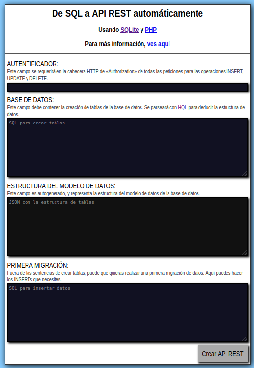
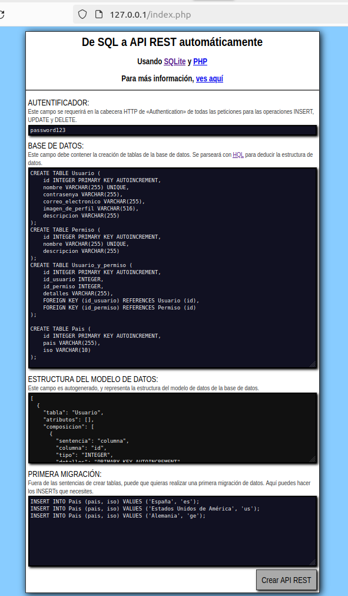
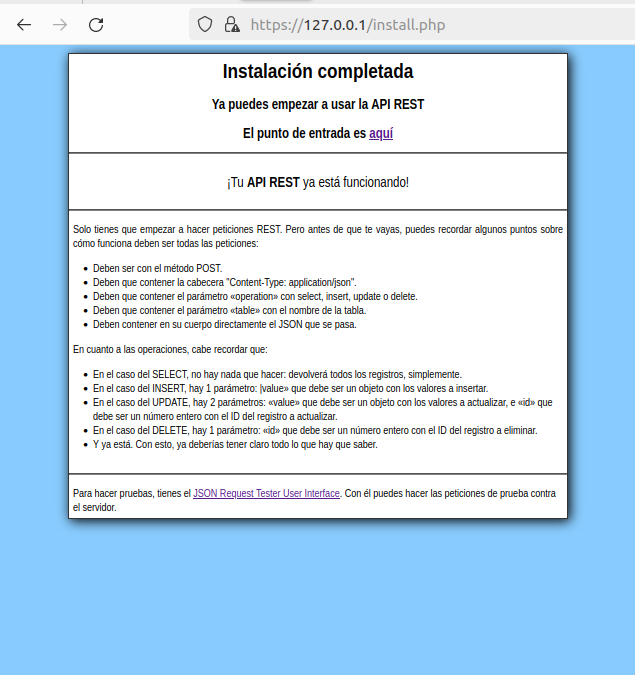

# restomatic-php

Little framework to automate HTTP REST API deployments based on SQL (SQLite or MySQL) databases.

### For what?

To build easy and fast HTTP REST APIs using static PHP and SQL database (SQLite or MySQL).

### Installation

1. Download the project.
2. Place the project on the folder of the static PHP server you prefer.
3. Set your specific environment variables on «settings.env».
   1. Mainly, the database type (sqlite or mysql) and file or credentials. Be sure to never upload this file to your public repositories. The file in this project is uploaded as template and to mention the remarkable variables.
4. Visit the «index.php» with the navigator in order to open the installator. *Image 1.* 
5. Fulfill the installator. *Image 2.* 
6. Click on "Create REST API". *Image 3.* 
7. Visit the «/jtrui» to test your new fresh API. *Image 4.* 

### What else?

This project is only to put a REST API to work automatically. It is not aimed to develop a client consumer: just to provide the infraestructure to persist data and make it accessible through the web. And this is what it does.

So, from here, it is expected that *you* code the consumer of the API.